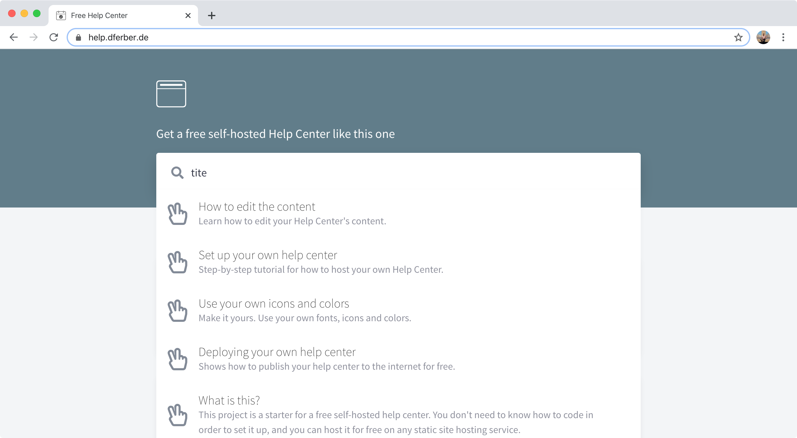
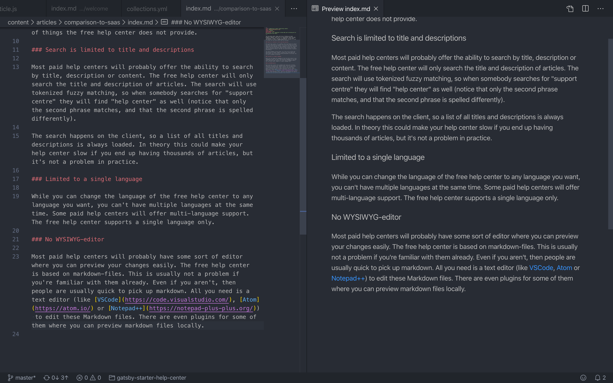

The free help center comes with tons of features which paid products offer as well. However, since this is a side-project there are some limitations to what it can do. It's important to talk about non-features in order to manage expectations. So here is a list of things the free help center does not provide.

### Search is limited to title and descriptions

Most paid help centers will probably offer the ability to search by title, description or content. The free help center will only search the title and description of articles. This tradeoff was made to keep the hosting simple.

If you really want to, you can edit the help center to search the content of the articles as well. Depending on the number of articles you have, this might increase the initial load time quite a bit.

The search will use tokenized fuzzy matching, so when somebody searches for "support centre" they will find "help center" as well (notice that only the second phrase matches, and that the second phrase is spelled differently).

The search happens on the client, so a list of all titles and descriptions is always loaded. In theory this could make your help center slow if you end up having thousands of articles, but it's not a problem in practice.

### Limited to a single language

While you can change the language of the free help center to any language you want, you can't have multiple languages at the same time. Some paid help centers will offer multi-language support. The free help center supports a single language only.

### No WYSIWYG-editor

Most paid help centers will probably have some sort of editor where you can preview your changes easily. The free help center is based on markdown-files. This is usually not a problem if you're familiar with them already. Even if you aren't, then people are usually quick to pick up markdown. All you need is a text editor (like [VSCode](https://code.visualstudio.com/), [Atom](https://atom.io/) or [Notepad++](https://notepad-plus-plus.org/)) to edit these Markdown files. There are even plugins for some of them where you can preview markdown files locally as shown in the screenshot below.

### No revisions

When you modify articles, the old version of your article will not be kept around. However as you'll most likely use git to manage your content, you 'll be able to see all changes made to your articles in your git history.

### No permission/role system

The free help center does not come with a system of permissions or roles. If you're a big team where many different people work on your help center, you'll probably want to use a paid help center. You could use git's permissions instead. Your editors could send pull-requests with changes, which your trusted team would need to approve and merge. This system will get you there, but it's not the same as having it built in.

### Search federated with other SaaS products

Some paid help centers have integrations for their support messenger widgets, like [Intercom](https://www.intercom.com/). The free help center does not have those.

### No automated "last modified" dates.

When you change the content of your articles, you'll need to set the "last modified" date which shows up on the article page. To do that, you'll need to manually edit the `modifiedDate` field on the article's markdown file.

Paid help centers will typically do this for you automatically.

### No tracking of search terms

Some help centers let you see what your users searched for. You can learn more about the behavior of your users and adapt your content so that the most common searches will have good matches.

The free help center does not track your user's searches.

### No votes on articles

Some help centers let your users vote on how helpfull individual articles were. This helps with writing better content. The free help center has no such functionality, as it would make self-hosting much harder.

### No automated updates

Paid SaaS help centers will typically be updated by your vendor. When a bug is discovered, they will fix it on your production site without you ever learning about it.

As you host the free help center yourself, and as you'll get the whole source files you'll need check for updates periodically and apply them. Adding these patches gets harder when you heavily customized the help center. It should be fine as long as you've only edited the files which are intended to be changed.

_If there is enough interest in the free help center, then we'll convert it to a Gatsby theme. The update process will be easier then._

### No support

As the free help center is a spare-time open-source project, there is no guarantee for support. Lots of effort is put into writing comprehensive documentation instead.

## Alternatives

You can find a listing of alternatives to this free help center [here](/articles/alternatives).
